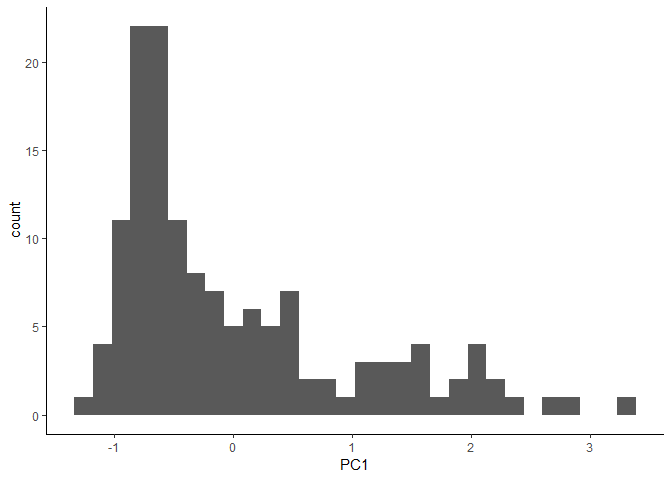
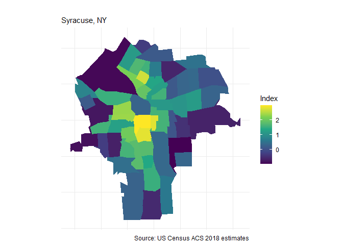
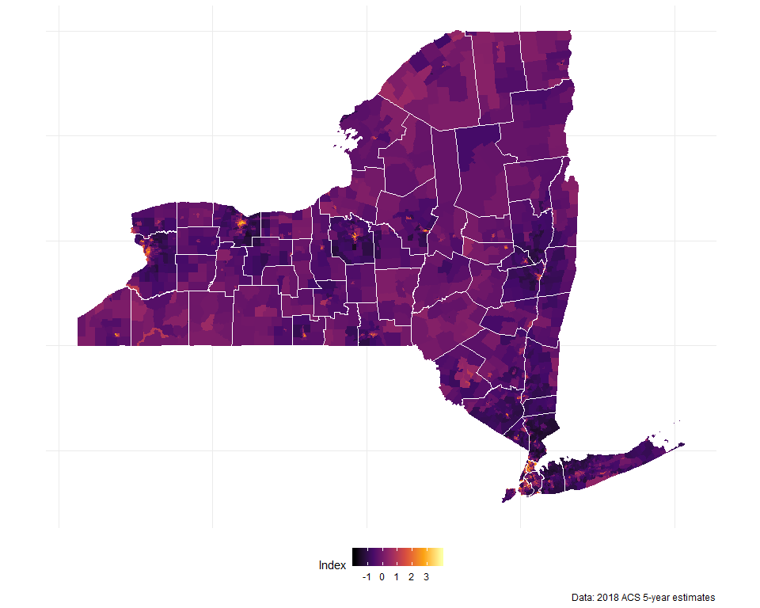
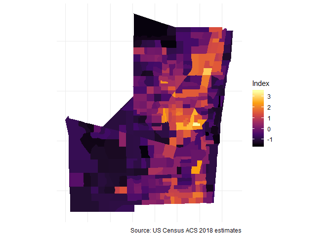
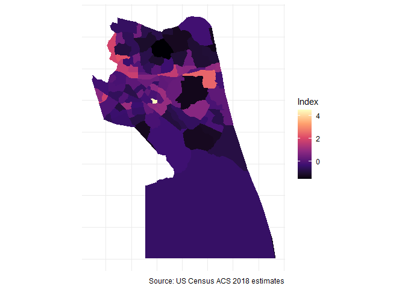
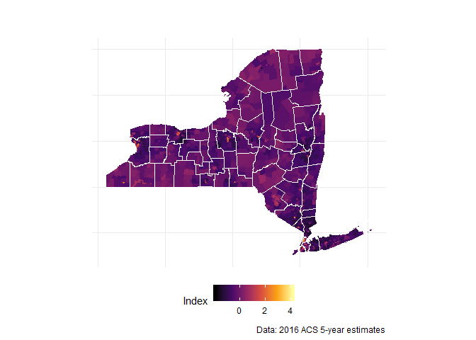

Creating a Deprivation Index in R using Census estimates
========================================================

This is an R function to extract census variables and calculate a deprivation index. Index is based on methodology by Messer and colleagues (<https://www.ncbi.nlm.nih.gov/pubmed/17031568>). Function relies on the packages tidycensus by Kyle Walker (<https://walkerke.github.io/tidycensus/>) and psych by William Revelle (<https://personality-project.org/r/psych/>)

``` r
library(tidycensus)
library(tidyverse)
library(psych)
library(viridis)
library(knitr)

## install Census API Key
```

Function
========

Before running the function script a Census API key is required: <https://api.census.gov/data/key_signup.html>. Data fetched are American Community Survey (ACS) 5-year estimates.

The purpose of this function is to minimize the time required to collect data. Extracting all these variables from <https://factfinder.census.gov> is a time consuming process.

Messer and colleagues identified that the principal component extracted from eight specific variables best represent neighborhood-level deprivation. Following their methods, this function collects census estimates and calculates the following variables:

% with less than HS degree (25 years and over)

% in below poverty level

% of female-headed households with children uner 18

% in managment, science, and arts occupation

% in crowded households (greater than 1 occupant per room)

% with public assistance or food stamps

% unemployed (16-64 years old in labor force)

% with less than 30K annual household income

Although the tidycensus package has the option to import Census tables into R, I found it easier to look them up online: <https://api.census.gov/data/2016/acs/acs5/variables.html>

``` r
countyND <- function(arg1,arg2){vars <- c("B17001_002", "B17001_001", "B06009_002" , "B06009_001",
                                         "B09008_011", "B09008_001","B08124_002", "B08124_001", "B25014_005", 
                                         "B25014_006",  "B25014_007","B25014_011", "B25014_012", "B25014_013",  
                                         "B25014_001", "B19058_002", "B19058_001","C23002C_021", "C23002D_008", 
                                         "C23002C_017", "C23002D_003","B19001_002", "B19001_003", "B19001_004", 
                                         "B19001_005", "B19001_006", "B19001_001")
acs_data <- get_acs(geography = "tract", variables =vars,state = arg1,  
                    county = arg2,output = "wide") %>%
  mutate(pct_poverty = B17001_002E/B17001_001E,
         pct_noHS = B06009_002E / B06009_001E,
         pct_FHH = B09008_011E / B09008_001E,
         pct_mgmt = B08124_002E /  B08124_001E, 
         pct_crowd =  (B25014_005E +B25014_006E+ B25014_007E + 
                         B25014_011E + B25014_012E + B25014_013E) / B25014_001E,
         pct_pubassist = B19058_002E/B19058_001E,
         pct_unempl = (C23002C_021E + C23002D_008E)  / (C23002C_017E + C23002D_003E),
         pct_under30K =( B19001_002E+B19001_003E+B19001_004E+B19001_005E +
                           B19001_006E) / B19001_001E)
values  <-  acs_data %>% select(pct_poverty,pct_noHS,pct_FHH,pct_mgmt,pct_crowd,
                                pct_pubassist, pct_unempl,pct_under30K) %>% as.matrix()
values[is.nan(values)] <- 0
ND <- principal(values,nfactors = 1)          
NDI <- cbind(acs_data,ND$scores) 
NDI <- NDI %>% select(NAME,GEOID,PC1) %>% 
  separate(NAME, into = c("Tract", "County","State"), sep = ",")
}
```

Using function
==============

`countyND` will extract census estimates at the tract level, transform the variables, and then perform a Principal Component Analysis by using the arguments State and County. Since this index has been previously validated, the function only extracts one component.

Example:

``` r
NDI <-countyND("NY","Onondaga")
kable(NDI, format = "markdown")
```

| Tract               | County          | State    | GEOID       |         PC1|
|:--------------------|:----------------|:---------|:------------|-----------:|
| Census Tract 1      | Onondaga County | New York | 36067000100 |  -0.5810257|
| Census Tract 2      | Onondaga County | New York | 36067000200 |   0.9065381|
| Census Tract 3      | Onondaga County | New York | 36067000300 |   0.0149922|
| Census Tract 4      | Onondaga County | New York | 36067000400 |  -0.0275154|
| Census Tract 5.01   | Onondaga County | New York | 36067000501 |   2.1509337|
| Census Tract 6      | Onondaga County | New York | 36067000600 |   1.8661977|
| Census Tract 7      | Onondaga County | New York | 36067000700 |   1.1474934|
| Census Tract 8      | Onondaga County | New York | 36067000800 |   0.3707069|
| Census Tract 9      | Onondaga County | New York | 36067000900 |  -0.5343635|
| Census Tract 10     | Onondaga County | New York | 36067001000 |   0.6482157|
| Census Tract 14     | Onondaga County | New York | 36067001400 |   3.3472218|
| Census Tract 15     | Onondaga County | New York | 36067001500 |   1.5649294|
| Census Tract 16     | Onondaga County | New York | 36067001600 |   1.1750842|
| Census Tract 17.01  | Onondaga County | New York | 36067001701 |   0.7894200|
| Census Tract 17.02  | Onondaga County | New York | 36067001702 |  -0.0694723|
| Census Tract 18     | Onondaga County | New York | 36067001800 |   0.2605928|
| Census Tract 19     | Onondaga County | New York | 36067001900 |  -0.0783185|
| Census Tract 20     | Onondaga County | New York | 36067002000 |   0.6173944|
| Census Tract 21.01  | Onondaga County | New York | 36067002101 |   1.2566751|
| Census Tract 23     | Onondaga County | New York | 36067002300 |   1.3252263|
| Census Tract 24     | Onondaga County | New York | 36067002400 |   1.9702315|
| Census Tract 27     | Onondaga County | New York | 36067002700 |   0.4607906|
| Census Tract 29.01  | Onondaga County | New York | 36067002901 |  -0.3835845|
| Census Tract 30     | Onondaga County | New York | 36067003000 |   2.1499832|
| Census Tract 32     | Onondaga County | New York | 36067003200 |   0.4319246|
| Census Tract 34     | Onondaga County | New York | 36067003400 |   1.6023386|
| Census Tract 35     | Onondaga County | New York | 36067003500 |   1.3719502|
| Census Tract 36.01  | Onondaga County | New York | 36067003601 |   1.0611811|
| Census Tract 36.02  | Onondaga County | New York | 36067003602 |   0.4486057|
| Census Tract 38     | Onondaga County | New York | 36067003800 |   1.5009269|
| Census Tract 39     | Onondaga County | New York | 36067003900 |   1.8586353|
| Census Tract 40     | Onondaga County | New York | 36067004000 |   2.3045609|
| Census Tract 42     | Onondaga County | New York | 36067004200 |   2.7562752|
| Census Tract 43.01  | Onondaga County | New York | 36067004301 |   2.7031238|
| Census Tract 43.02  | Onondaga County | New York | 36067004302 |   1.6283003|
| Census Tract 44     | Onondaga County | New York | 36067004400 |   0.1747989|
| Census Tract 45     | Onondaga County | New York | 36067004500 |  -0.4754307|
| Census Tract 46     | Onondaga County | New York | 36067004600 |  -0.5657825|
| Census Tract 48     | Onondaga County | New York | 36067004800 |  -0.6590310|
| Census Tract 49     | Onondaga County | New York | 36067004900 |   0.4489018|
| Census Tract 50     | Onondaga County | New York | 36067005000 |  -0.4772940|
| Census Tract 51     | Onondaga County | New York | 36067005100 |   1.3387407|
| Census Tract 52     | Onondaga County | New York | 36067005200 |   2.0423338|
| Census Tract 53     | Onondaga County | New York | 36067005300 |   2.0818629|
| Census Tract 54     | Onondaga County | New York | 36067005400 |   2.1195243|
| Census Tract 55     | Onondaga County | New York | 36067005500 |   0.1691951|
| Census Tract 56.01  | Onondaga County | New York | 36067005601 |  -0.9409207|
| Census Tract 56.02  | Onondaga County | New York | 36067005602 |   0.5272611|
| Census Tract 57     | Onondaga County | New York | 36067005700 |   0.3726579|
| Census Tract 58     | Onondaga County | New York | 36067005800 |   1.3152597|
| Census Tract 59     | Onondaga County | New York | 36067005900 |   1.7127719|
| Census Tract 60     | Onondaga County | New York | 36067006000 |   0.4541647|
| Census Tract 61.01  | Onondaga County | New York | 36067006101 |   1.4442721|
| Census Tract 61.02  | Onondaga County | New York | 36067006102 |   0.7710752|
| Census Tract 61.03  | Onondaga County | New York | 36067006103 |  -0.3705480|
| Census Tract 101    | Onondaga County | New York | 36067010100 |  -0.8203130|
| Census Tract 102    | Onondaga County | New York | 36067010200 |  -0.1099771|
| Census Tract 103.01 | Onondaga County | New York | 36067010301 |  -0.5529941|
| Census Tract 103.21 | Onondaga County | New York | 36067010321 |  -0.8631307|
| Census Tract 103.22 | Onondaga County | New York | 36067010322 |  -0.7332066|
| Census Tract 104    | Onondaga County | New York | 36067010400 |  -0.6461266|
| Census Tract 105    | Onondaga County | New York | 36067010500 |  -0.7826637|
| Census Tract 106    | Onondaga County | New York | 36067010600 |  -0.3593990|
| Census Tract 107    | Onondaga County | New York | 36067010700 |   0.0537866|
| Census Tract 108    | Onondaga County | New York | 36067010800 |  -0.1347406|
| Census Tract 109    | Onondaga County | New York | 36067010900 |  -0.1613331|
| Census Tract 110.11 | Onondaga County | New York | 36067011011 |  -0.6723151|
| Census Tract 110.12 | Onondaga County | New York | 36067011012 |  -0.6479199|
| Census Tract 110.21 | Onondaga County | New York | 36067011021 |  -0.6130401|
| Census Tract 110.22 | Onondaga County | New York | 36067011022 |  -0.4375532|
| Census Tract 111.01 | Onondaga County | New York | 36067011101 |  -0.8483799|
| Census Tract 111.02 | Onondaga County | New York | 36067011102 |   0.0956508|
| Census Tract 112.01 | Onondaga County | New York | 36067011201 |  -0.4357451|
| Census Tract 112.02 | Onondaga County | New York | 36067011202 |  -0.9870104|
| Census Tract 112.31 | Onondaga County | New York | 36067011231 |  -0.5108487|
| Census Tract 112.32 | Onondaga County | New York | 36067011232 |  -0.7794073|
| Census Tract 112.41 | Onondaga County | New York | 36067011241 |  -1.1285766|
| Census Tract 112.42 | Onondaga County | New York | 36067011242 |  -0.5679681|
| Census Tract 113    | Onondaga County | New York | 36067011300 |  -0.6940797|
| Census Tract 114.01 | Onondaga County | New York | 36067011401 |  -0.6508819|
| Census Tract 114.02 | Onondaga County | New York | 36067011402 |  -0.7239710|
| Census Tract 115    | Onondaga County | New York | 36067011500 |  -0.8156555|
| Census Tract 116    | Onondaga County | New York | 36067011600 |  -0.6239891|
| Census Tract 117    | Onondaga County | New York | 36067011700 |  -0.2012566|
| Census Tract 118    | Onondaga County | New York | 36067011800 |  -0.4918225|
| Census Tract 119    | Onondaga County | New York | 36067011900 |  -0.7623543|
| Census Tract 120    | Onondaga County | New York | 36067012000 |  -0.2412700|
| Census Tract 121    | Onondaga County | New York | 36067012100 |  -0.8057288|
| Census Tract 122    | Onondaga County | New York | 36067012200 |  -0.2859078|
| Census Tract 123    | Onondaga County | New York | 36067012300 |  -0.9202648|
| Census Tract 124    | Onondaga County | New York | 36067012400 |  -0.6134076|
| Census Tract 125    | Onondaga County | New York | 36067012500 |  -0.5658341|
| Census Tract 126    | Onondaga County | New York | 36067012600 |  -0.7704605|
| Census Tract 127    | Onondaga County | New York | 36067012700 |  -0.6053640|
| Census Tract 128    | Onondaga County | New York | 36067012800 |  -0.4982791|
| Census Tract 129    | Onondaga County | New York | 36067012900 |   0.1511670|
| Census Tract 130    | Onondaga County | New York | 36067013000 |  -0.2093399|
| Census Tract 131    | Onondaga County | New York | 36067013100 |  -0.7858499|
| Census Tract 132    | Onondaga County | New York | 36067013200 |  -0.7067261|
| Census Tract 133    | Onondaga County | New York | 36067013300 |  -0.7599286|
| Census Tract 134    | Onondaga County | New York | 36067013400 |  -0.8759889|
| Census Tract 135    | Onondaga County | New York | 36067013500 |  -0.9415834|
| Census Tract 136    | Onondaga County | New York | 36067013600 |  -0.6257373|
| Census Tract 137.01 | Onondaga County | New York | 36067013701 |   0.1656213|
| Census Tract 138    | Onondaga County | New York | 36067013800 |  -0.4265600|
| Census Tract 139    | Onondaga County | New York | 36067013900 |   0.1496536|
| Census Tract 140    | Onondaga County | New York | 36067014000 |   0.3104837|
| Census Tract 142    | Onondaga County | New York | 36067014200 |  -0.1287243|
| Census Tract 143    | Onondaga County | New York | 36067014300 |   0.2464095|
| Census Tract 144    | Onondaga County | New York | 36067014400 |   0.4331853|
| Census Tract 145    | Onondaga County | New York | 36067014500 |  -0.5049009|
| Census Tract 146    | Onondaga County | New York | 36067014600 |  -0.3886248|
| Census Tract 147    | Onondaga County | New York | 36067014700 |  -1.1161462|
| Census Tract 148    | Onondaga County | New York | 36067014800 |  -0.9652225|
| Census Tract 149    | Onondaga County | New York | 36067014900 |  -0.7723603|
| Census Tract 150    | Onondaga County | New York | 36067015000 |  -1.0556084|
| Census Tract 151    | Onondaga County | New York | 36067015100 |  -0.9744365|
| Census Tract 152.01 | Onondaga County | New York | 36067015201 |  -0.6260357|
| Census Tract 152.02 | Onondaga County | New York | 36067015202 |  -1.0575099|
| Census Tract 152.03 | Onondaga County | New York | 36067015203 |  -0.9835354|
| Census Tract 154    | Onondaga County | New York | 36067015400 |  -0.6620511|
| Census Tract 155    | Onondaga County | New York | 36067015500 |  -0.8371243|
| Census Tract 156.01 | Onondaga County | New York | 36067015601 |  -0.3175548|
| Census Tract 157    | Onondaga County | New York | 36067015700 |  -0.9702111|
| Census Tract 158    | Onondaga County | New York | 36067015800 |  -0.3463908|
| Census Tract 160.01 | Onondaga County | New York | 36067016001 |  -0.6564851|
| Census Tract 160.02 | Onondaga County | New York | 36067016002 |  -0.9466091|
| Census Tract 161    | Onondaga County | New York | 36067016100 |  -0.7239331|
| Census Tract 162    | Onondaga County | New York | 36067016200 |  -0.1017244|
| Census Tract 163    | Onondaga County | New York | 36067016300 |  -0.8340282|
| Census Tract 164    | Onondaga County | New York | 36067016400 |  -0.7103106|
| Census Tract 165.01 | Onondaga County | New York | 36067016501 |  -0.7299441|
| Census Tract 165.02 | Onondaga County | New York | 36067016502 |  -0.8072811|
| Census Tract 166    | Onondaga County | New York | 36067016600 |  -0.8829266|
| Census Tract 167    | Onondaga County | New York | 36067016700 |  -1.2202387|
| Census Tract 168.01 | Onondaga County | New York | 36067016801 |  -0.6989105|
| Census Tract 168.02 | Onondaga County | New York | 36067016802 |  -0.5416647|
| Census Tract 169.01 | Onondaga County | New York | 36067016901 |  -0.7648391|
| Census Tract 169.02 | Onondaga County | New York | 36067016902 |  -0.5523366|
| Census Tract 9400   | Onondaga County | New York | 36067940000 |  -0.8333814|

The output variable 'PC1' is the deprivation index score for each corresponding census tract (CT) in the analysis. Higher index scores represent higher deprivation. These scores can be explored on their own or exported for use in statistical models.

Here is the distribution of deprivation across tracts in Onondaga County, NY

``` r
ggplot(NDI, aes(PC1)) + geom_histogram() + theme_classic()
```



If we categorize census-tracts by Syracuse City CT and County CT, we can see that City tracts tend to have more deprived environments than County tracts.

``` r
NDI$type[as.numeric(NDI$GEOID) < 36067006104] <- "City Tract"
NDI$type[as.numeric(NDI$GEOID) >= 36067006104] <- "County Tract"

ggplot(NDI, aes(reorder(Tract, -PC1), PC1)) + geom_col(aes(fill = type)) + coord_flip() +
  theme(axis.text.x = element_text(size = 8, color = "black"), 
        axis.text.y = element_text(size = 4, color = "black")) +
  scale_fill_viridis_d(option = "cividis") + 
  labs(fill = "", x = "Tract", y = "Deprivation Index")
```



Thematic Mapping
================

We can further explore the deprivation index by its spatial distribution. For this we'll need the following packages:

``` r
library(sf)
library(tigris)
options(tigris_class = "sf", tigris_use_cache = TRUE)
```

By mapping deprivation scores, we can see that high levels of deprivation concentrate within the City of Syracuse. However, if we map deprivation for city tracts only, we can still see some variation in scores.

``` r
## get census tracts 
tractsNY <- tracts(state = "NY",  county = "Onondaga County",
                 cb = TRUE)
Map <- geo_join(tractsNY,NDI, by_sp = "GEOID", by_df = "GEOID")

ggplot() + geom_sf(data = Map, aes(fill = PC1)) +
  theme_minimal() + scale_fill_viridis()+
  labs(fill = "Index", caption = "Source: US Census ACS 2016 estimates")+
  ggtitle(" ", subtitle = "Onondaga County, NY")
```



``` r
## filter by census tract code
Map %>% filter(as.numeric(TRACTCE) < 6104) %>%
  ggplot() + geom_sf(aes(fill = PC1)) +
  theme_minimal() + scale_fill_viridis()+
  labs(fill = "Index", caption = "Source: US Census ACS 2016 estimates")+
  ggtitle(" ", subtitle = "Syracuse, NY")
```


Additional examples using `countyND`
------------------------------------

Broward County, FL

``` r
NDI2 <- countyND("FL","Broward")
tractsFL <- tracts(state = "FL",  county = "Broward",
                 cb = TRUE)
Map2 <- geo_join(tractsFL,NDI2, by_sp = "GEOID", by_df = "GEOID")

Map2 %>% filter(as.numeric(TRACTCE) < 980000) %>%  ## exclude Everglades Nat'l Park
ggplot() + geom_sf(aes(fill = PC1)) +
  theme_minimal() + scale_fill_viridis()+
  labs(fill = "Index", caption = "Source: US Census ACS 2016 estimates")+
  ggtitle(" ", subtitle = "Broward County, FL")
```



Virginia Beach, VA

``` r
### Virgina Beach
NDI3 <- countyND("VA","Virginia Beach")
tractsVA <- tracts(state = "VA",  county = "Virginia Beach",
                   cb = TRUE)
Map3 <- geo_join(tractsVA,NDI3, by_sp = "GEOID", by_df = "GEOID")

ggplot() + geom_sf(data = Map3, aes(fill = PC1)) +
  theme_minimal() + scale_fill_viridis()+
  labs(fill = "Index", caption = "Source: US Census ACS 2016 estimates")+
  ggtitle(" ", subtitle = "Virginia Beach, VA")
```



Deprivation Index function for entire State
-------------------------------------------

`stateND` will perform the same analysis at the tract-level for an entire state.

``` r
stateND <- function(arg1){vars <- c("B17001_002", "B17001_001", "B06009_002" , "B06009_001",
                                         "B09008_011", "B09008_001","B08124_002", "B08124_001", "B25014_005", 
                                         "B25014_006",  "B25014_007","B25014_011", "B25014_012", "B25014_013",  
                                         "B25014_001", "B19058_002", "B19058_001","C23002C_021", "C23002D_008", 
                                         "C23002C_017", "C23002D_003","B19001_002", "B19001_003", "B19001_004", 
                                         "B19001_005", "B19001_006", "B19001_001")
acs_data <- get_acs(geography = "tract", variables =vars,state = arg1,  
                    output = "wide") %>%
  mutate(pct_poverty = B17001_002E/B17001_001E,
         pct_noHS = B06009_002E / B06009_001E,
         pct_FHH = B09008_011E / B09008_001E,
         pct_mgmt = B08124_002E /  B08124_001E, 
         pct_crowd =  (B25014_005E +B25014_006E+ B25014_007E + 
                         B25014_011E + B25014_012E + B25014_013E) / B25014_001E,
         pct_pubassist = B19058_002E/B19058_001E,
         pct_unempl = (C23002C_021E + C23002D_008E)  / (C23002C_017E + C23002D_003E),
         pct_under30K =( B19001_002E+B19001_003E+B19001_004E+B19001_005E +
                           B19001_006E) / B19001_001E)
values  <-  acs_data %>% select(pct_poverty,pct_noHS,pct_FHH,pct_mgmt,pct_crowd,
                                pct_pubassist, pct_unempl,pct_under30K) %>% as.matrix()
values[is.nan(values)] <- 0
ND <- principal(values,nfactors = 1)          
NDI <- cbind(acs_data,ND$scores) 
NDI <- NDI %>% select(NAME,GEOID,PC1) %>% 
  separate(NAME, into = c("Tract", "County","State"), sep = ",")
}
```

Neighborhood deprivation across New York State

``` r
NYND <- stateND("NY")
tractsNY <- tracts(state = "NY",
                 cb = TRUE)
countiesNY <- counties(state = "NY", cb = TRUE)

MapNY <- geo_join(tractsNY,NYND, by_sp = "GEOID", by_df = "GEOID")

ggplot() + geom_sf(data = MapNY, aes(fill = PC1, color = PC1)) +
  geom_sf(data = countiesNY, fill = NA, color = "#ffffff", size = .3) + 
  theme_minimal() + theme(axis.text = element_blank(), legend.position = "bottom") +
  scale_fill_viridis_c(option = "inferno") +
  scale_color_viridis_c(option = "inferno") +
  labs(fill = "Index",color = "Index",caption ="Data: 2016 ACS 5-year estimates") +
  ggtitle(" ", subtitle = "")
```


