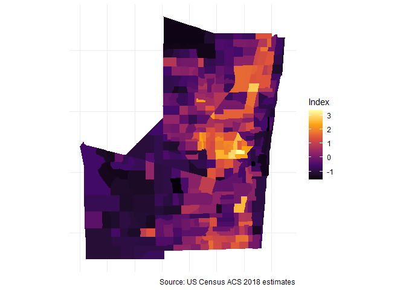

# Creating a Deprivation Index in R using Census estimates

This is an R function to extract census variables and calculate a
deprivation index. Census data fetched are American Community Survey
(ACS) 5-year estimates. Manually extracting all these estimates from
<https://factfinder.census.gov> is a time consuming process.

The index is based on methodology by [Messer and
colleagues](https://www.ncbi.nlm.nih.gov/pubmed/17031568). Messer and
colleagues identified that the principal component extracted from eight
variables (below), calculated from Census estimates, best represent
neighborhood-level deprivation.

-   % with less than HS degree (25 years and over)

-   % in below poverty level

-   % of female-headed households with children uner 18

-   % in management, science, and arts occupation

-   % in crowded households (greater than 1 occupant per room)

-   % with public assistance or food stamps

-   % unemployed (16-64 years old in labor force)

-   % with less than 30K annual household income

## Usage

`ndi` will extract Census estimates at the tract level, transform the
variables, and then perform a Principal Component Analysis by using the
arguments *State* and *County*. Since this index has been previously
validated, the function only extracts one component.

#### Housekeeping

Before using the function, a Census API key is required. You can get one
for free here: <https://api.census.gov/data/key_signup.html>.

To run this function, you’ll need a few of the core
[tidyverse](https://tidyverse.tidyverse.org/articles/paper.html)
packages, as well as
[tidycensus](https://walkerke.github.io/tidycensus/) by Kyle Walker and
[psych](https://personality-project.org/r/psych/) by William Revelle.

### Examples

``` r
library(tidycensus)
library(tidyverse)
library(psych)

#-- for plotting maps 
library(tigris)
options(tigris_class = "sf", 
        tigris_use_cache = TRUE)

#-- source script
source("R/ndi.R")

#-- index function 
ndi("NY","Onondaga")
```

    ## # A tibble: 140 x 13
    ##    Tract     County   State GEOID      NDI pct_poverty pct_noHS pct_FHH pct_mgmt
    ##    <chr>     <chr>    <chr> <chr>    <dbl>       <dbl>    <dbl>   <dbl>    <dbl>
    ##  1 Census T~ Onondag~ New ~ 36067~  0.684       0.318    0.262   0.184     0.344
    ##  2 Census T~ Onondag~ New ~ 36067~  1.36        0.334    0.303   0.301     0.188
    ##  3 Census T~ Onondag~ New ~ 36067~  2.34        0.578    0.342   0.582     0.222
    ##  4 Census T~ Onondag~ New ~ 36067~  0.304       0.399    0.134   0.274     0.692
    ##  5 Census T~ Onondag~ New ~ 36067~  2.14        0.370    0.457   0.560     0.245
    ##  6 Census T~ Onondag~ New ~ 36067~  1.53        0.508    0.276   0.318     0.201
    ##  7 Census T~ Onondag~ New ~ 36067~ -0.779       0.0559   0.0448  0         0.490
    ##  8 Census T~ Onondag~ New ~ 36067~  2.79        0.763    0.333   0.970     0.160
    ##  9 Census T~ Onondag~ New ~ 36067~  1.60        0.796    0.237   0         0.390
    ## 10 Census T~ Onondag~ New ~ 36067~ -0.0944      0.0955   0.137   0.0728    0.245
    ## # ... with 130 more rows, and 4 more variables: pct_crowd <dbl>,
    ## #   pct_pubassist <dbl>, pct_unempl <dbl>, pct_under30K <dbl>

The output variable *NDI* is the deprivation index score for each
corresponding census tract (CT) in the analysis. **Higher index scores
represent higher deprivation.** These scores can be explored on their
own or exported for use in statistical models.

Here is the distribution of deprivation across tracts in Onondaga
County, NY

<!-- -->

If we categorize census-tracts by Syracuse City CT and County CT, we can
see that City tracts tend to have more deprived environments than County
tracts.

<!-- -->

## Thematic Mapping

We can further explore the deprivation index by its spatial
distribution.

By mapping deprivation scores, we can see that high levels of
deprivation concentrate within the City of Syracuse. However, if we map
deprivation for city tracts only, we can still see some variation in
scores.

    ##   |                                                                              |                                                                      |   0%  |                                                                              |=                                                                     |   1%  |                                                                              |=                                                                     |   2%  |                                                                              |==                                                                    |   3%  |                                                                              |===                                                                   |   4%  |                                                                              |===                                                                   |   5%  |                                                                              |====                                                                  |   5%  |                                                                              |====                                                                  |   6%  |                                                                              |=====                                                                 |   7%  |                                                                              |======                                                                |   8%  |                                                                              |======                                                                |   9%  |                                                                              |=======                                                               |  10%  |                                                                              |=======                                                               |  11%  |                                                                              |========                                                              |  11%  |                                                                              |========                                                              |  12%  |                                                                              |=========                                                             |  13%  |                                                                              |==========                                                            |  14%  |                                                                              |==========                                                            |  15%  |                                                                              |===========                                                           |  16%  |                                                                              |============                                                          |  17%  |                                                                              |=============                                                         |  18%  |                                                                              |==============                                                        |  19%  |                                                                              |==============                                                        |  20%  |                                                                              |===============                                                       |  21%  |                                                                              |===============                                                       |  22%  |                                                                              |================                                                      |  22%  |                                                                              |================                                                      |  23%  |                                                                              |=================                                                     |  24%  |                                                                              |==================                                                    |  25%  |                                                                              |==================                                                    |  26%  |                                                                              |===================                                                   |  27%  |                                                                              |===================                                                   |  28%  |                                                                              |====================                                                  |  28%  |                                                                              |=====================                                                 |  30%  |                                                                              |=====================                                                 |  31%  |                                                                              |======================                                                |  32%  |                                                                              |=======================                                               |  33%  |                                                                              |========================                                              |  34%  |                                                                              |=========================                                             |  35%  |                                                                              |=========================                                             |  36%  |                                                                              |==========================                                            |  37%  |                                                                              |===========================                                           |  38%  |                                                                              |===========================                                           |  39%  |                                                                              |============================                                          |  39%  |                                                                              |============================                                          |  41%  |                                                                              |=============================                                         |  42%  |                                                                              |==============================                                        |  43%  |                                                                              |===============================                                       |  44%  |                                                                              |================================                                      |  45%  |                                                                              |================================                                      |  46%  |                                                                              |=================================                                     |  47%  |                                                                              |=================================                                     |  48%  |                                                                              |==================================                                    |  48%  |                                                                              |===================================                                   |  50%  |                                                                              |====================================                                  |  51%  |                                                                              |====================================                                  |  52%  |                                                                              |=====================================                                 |  53%  |                                                                              |======================================                                |  54%  |                                                                              |=======================================                               |  55%  |                                                                              |=======================================                               |  56%  |                                                                              |========================================                              |  56%  |                                                                              |========================================                              |  57%  |                                                                              |=========================================                             |  58%  |                                                                              |=========================================                             |  59%  |                                                                              |==========================================                            |  60%  |                                                                              |===========================================                           |  61%  |                                                                              |===========================================                           |  62%  |                                                                              |============================================                          |  63%  |                                                                              |==============================================                        |  65%  |                                                                              |==============================================                        |  66%  |                                                                              |===============================================                       |  67%  |                                                                              |===============================================                       |  68%  |                                                                              |================================================                      |  69%  |                                                                              |=================================================                     |  70%  |                                                                              |==================================================                    |  71%  |                                                                              |===================================================                   |  72%  |                                                                              |===================================================                   |  73%  |                                                                              |====================================================                  |  74%  |                                                                              |=====================================================                 |  75%  |                                                                              |======================================================                |  76%  |                                                                              |======================================================                |  78%  |                                                                              |=======================================================               |  79%  |                                                                              |========================================================              |  80%  |                                                                              |=========================================================             |  81%  |                                                                              |=========================================================             |  82%  |                                                                              |==========================================================            |  82%  |                                                                              |==========================================================            |  83%  |                                                                              |===========================================================           |  84%  |                                                                              |===========================================================           |  85%  |                                                                              |============================================================          |  85%  |                                                                              |============================================================          |  86%  |                                                                              |=============================================================         |  87%  |                                                                              |=============================================================         |  88%  |                                                                              |==============================================================        |  89%  |                                                                              |===============================================================       |  90%  |                                                                              |================================================================      |  91%  |                                                                              |=================================================================     |  92%  |                                                                              |=================================================================     |  93%  |                                                                              |===================================================================   |  95%  |                                                                              |===================================================================   |  96%  |                                                                              |====================================================================  |  97%  |                                                                              |===================================================================== |  99%  |                                                                              |======================================================================| 100%

<!-- -->

<!-- -->

## Deprivation Index function for an entire State

By ommiting the county argument, the function will perform the same
analysis for the entire state named. Additionally, you can find a New
York City index
[here](https://github.com/iecastro/deprivation-index/blob/master/NYC/nyc_ndi.R).

### Neighborhood deprivation across New York State

<!-- -->

    ##   |                                                                              |                                                                      |   0%  |                                                                              |                                                                      |   1%  |                                                                              |=                                                                     |   1%  |                                                                              |=                                                                     |   2%  |                                                                              |==                                                                    |   2%  |                                                                              |==                                                                    |   3%  |                                                                              |==                                                                    |   4%  |                                                                              |===                                                                   |   4%  |                                                                              |===                                                                   |   5%  |                                                                              |====                                                                  |   5%  |                                                                              |====                                                                  |   6%  |                                                                              |=====                                                                 |   7%  |                                                                              |=====                                                                 |   8%  |                                                                              |======                                                                |   8%  |                                                                              |======                                                                |   9%  |                                                                              |=======                                                               |   9%  |                                                                              |=======                                                               |  10%  |                                                                              |=======                                                               |  11%  |                                                                              |========                                                              |  11%  |                                                                              |========                                                              |  12%  |                                                                              |=========                                                             |  12%  |                                                                              |=========                                                             |  13%  |                                                                              |==========                                                            |  14%  |                                                                              |==========                                                            |  15%  |                                                                              |===========                                                           |  15%  |                                                                              |===========                                                           |  16%  |                                                                              |============                                                          |  16%  |                                                                              |============                                                          |  17%  |                                                                              |============                                                          |  18%  |                                                                              |=============                                                         |  18%  |                                                                              |=============                                                         |  19%  |                                                                              |==============                                                        |  19%  |                                                                              |==============                                                        |  20%  |                                                                              |==============                                                        |  21%  |                                                                              |===============                                                       |  21%  |                                                                              |===============                                                       |  22%  |                                                                              |================                                                      |  22%  |                                                                              |================                                                      |  23%  |                                                                              |=================                                                     |  24%  |                                                                              |=================                                                     |  25%  |                                                                              |==================                                                    |  25%  |                                                                              |==================                                                    |  26%  |                                                                              |===================                                                   |  27%  |                                                                              |===================                                                   |  28%  |                                                                              |====================                                                  |  28%  |                                                                              |====================                                                  |  29%  |                                                                              |=====================                                                 |  29%  |                                                                              |=====================                                                 |  30%  |                                                                              |=====================                                                 |  31%  |                                                                              |======================                                                |  31%  |                                                                              |======================                                                |  32%  |                                                                              |=======================                                               |  32%  |                                                                              |=======================                                               |  33%  |                                                                              |=======================                                               |  34%  |                                                                              |========================                                              |  34%  |                                                                              |========================                                              |  35%  |                                                                              |=========================                                             |  35%  |                                                                              |=========================                                             |  36%  |                                                                              |==========================                                            |  37%  |                                                                              |==========================                                            |  38%  |                                                                              |===========================                                           |  38%  |                                                                              |===========================                                           |  39%  |                                                                              |============================                                          |  39%  |                                                                              |============================                                          |  40%  |                                                                              |============================                                          |  41%  |                                                                              |=============================                                         |  41%  |                                                                              |=============================                                         |  42%  |                                                                              |==============================                                        |  42%  |                                                                              |==============================                                        |  43%  |                                                                              |==============================                                        |  44%  |                                                                              |===============================                                       |  44%  |                                                                              |===============================                                       |  45%  |                                                                              |================================                                      |  45%  |                                                                              |================================                                      |  46%  |                                                                              |=================================                                     |  47%  |                                                                              |=================================                                     |  48%  |                                                                              |==================================                                    |  48%  |                                                                              |==================================                                    |  49%  |                                                                              |===================================                                   |  49%  |                                                                              |===================================                                   |  50%  |                                                                              |===================================                                   |  51%  |                                                                              |====================================                                  |  51%  |                                                                              |====================================                                  |  52%  |                                                                              |=====================================                                 |  52%  |                                                                              |=====================================                                 |  53%  |                                                                              |======================================                                |  54%  |                                                                              |======================================                                |  55%  |                                                                              |=======================================                               |  55%  |                                                                              |=======================================                               |  56%  |                                                                              |========================================                              |  56%  |                                                                              |========================================                              |  57%  |                                                                              |========================================                              |  58%  |                                                                              |=========================================                             |  58%  |                                                                              |=========================================                             |  59%  |                                                                              |==========================================                            |  59%  |                                                                              |==========================================                            |  60%  |                                                                              |==========================================                            |  61%  |                                                                              |===========================================                           |  61%  |                                                                              |===========================================                           |  62%  |                                                                              |============================================                          |  62%  |                                                                              |============================================                          |  63%  |                                                                              |=============================================                         |  64%  |                                                                              |=============================================                         |  65%  |                                                                              |==============================================                        |  65%  |                                                                              |==============================================                        |  66%  |                                                                              |===============================================                       |  67%  |                                                                              |===============================================                       |  68%  |                                                                              |================================================                      |  68%  |                                                                              |================================================                      |  69%  |                                                                              |=================================================                     |  69%  |                                                                              |=================================================                     |  70%  |                                                                              |=================================================                     |  71%  |                                                                              |==================================================                    |  71%  |                                                                              |==================================================                    |  72%  |                                                                              |===================================================                   |  72%  |                                                                              |===================================================                   |  73%  |                                                                              |====================================================                  |  74%  |                                                                              |====================================================                  |  75%  |                                                                              |=====================================================                 |  75%  |                                                                              |=====================================================                 |  76%  |                                                                              |======================================================                |  77%  |                                                                              |======================================================                |  78%  |                                                                              |=======================================================               |  78%  |                                                                              |=======================================================               |  79%  |                                                                              |========================================================              |  79%  |                                                                              |========================================================              |  80%  |                                                                              |========================================================              |  81%  |                                                                              |=========================================================             |  81%  |                                                                              |=========================================================             |  82%  |                                                                              |==========================================================            |  82%  |                                                                              |==========================================================            |  83%  |                                                                              |===========================================================           |  84%  |                                                                              |===========================================================           |  85%  |                                                                              |============================================================          |  85%  |                                                                              |============================================================          |  86%  |                                                                              |=============================================================         |  86%  |                                                                              |=============================================================         |  87%  |                                                                              |=============================================================         |  88%  |                                                                              |==============================================================        |  88%  |                                                                              |==============================================================        |  89%  |                                                                              |===============================================================       |  89%  |                                                                              |===============================================================       |  90%  |                                                                              |================================================================      |  91%  |                                                                              |================================================================      |  92%  |                                                                              |=================================================================     |  92%  |                                                                              |=================================================================     |  93%  |                                                                              |==================================================================    |  94%  |                                                                              |==================================================================    |  95%  |                                                                              |===================================================================   |  95%  |                                                                              |===================================================================   |  96%  |                                                                              |====================================================================  |  96%  |                                                                              |====================================================================  |  97%  |                                                                              |====================================================================  |  98%  |                                                                              |===================================================================== |  98%  |                                                                              |===================================================================== |  99%  |                                                                              |======================================================================|  99%  |                                                                              |======================================================================| 100%

<!-- -->

### The 5 Boroughs

<!-- -->

## Additional examples using `ndi`

**Broward County, FL**

    ##   |                                                                              |                                                                      |   0%  |                                                                              |=                                                                     |   1%  |                                                                              |==                                                                    |   3%  |                                                                              |===                                                                   |   4%  |                                                                              |====                                                                  |   5%  |                                                                              |=====                                                                 |   7%  |                                                                              |======                                                                |   8%  |                                                                              |======                                                                |   9%  |                                                                              |=======                                                               |  11%  |                                                                              |========                                                              |  12%  |                                                                              |=========                                                             |  13%  |                                                                              |==========                                                            |  15%  |                                                                              |===========                                                           |  15%  |                                                                              |===========                                                           |  16%  |                                                                              |============                                                          |  17%  |                                                                              |==============                                                        |  20%  |                                                                              |===============                                                       |  21%  |                                                                              |===============                                                       |  22%  |                                                                              |================                                                      |  23%  |                                                                              |=================                                                     |  24%  |                                                                              |=================                                                     |  25%  |                                                                              |==================                                                    |  26%  |                                                                              |===================                                                   |  27%  |                                                                              |===================                                                   |  28%  |                                                                              |=====================                                                 |  30%  |                                                                              |======================                                                |  31%  |                                                                              |=======================                                               |  33%  |                                                                              |========================                                              |  35%  |                                                                              |=========================                                             |  36%  |                                                                              |==========================                                            |  37%  |                                                                              |===========================                                           |  39%  |                                                                              |============================                                          |  40%  |                                                                              |=============================                                         |  41%  |                                                                              |==============================                                        |  43%  |                                                                              |===============================                                       |  44%  |                                                                              |================================                                      |  45%  |                                                                              |================================                                      |  46%  |                                                                              |=================================                                     |  47%  |                                                                              |==================================                                    |  48%  |                                                                              |==================================                                    |  49%  |                                                                              |===================================                                   |  50%  |                                                                              |====================================                                  |  51%  |                                                                              |=====================================                                 |  53%  |                                                                              |======================================                                |  54%  |                                                                              |=======================================                               |  55%  |                                                                              |========================================                              |  57%  |                                                                              |=========================================                             |  58%  |                                                                              |=========================================                             |  59%  |                                                                              |===========================================                           |  61%  |                                                                              |============================================                          |  63%  |                                                                              |=============================================                         |  64%  |                                                                              |==============================================                        |  65%  |                                                                              |===============================================                       |  67%  |                                                                              |===============================================                       |  68%  |                                                                              |================================================                      |  69%  |                                                                              |=================================================                     |  70%  |                                                                              |==================================================                    |  72%  |                                                                              |===================================================                   |  73%  |                                                                              |====================================================                  |  74%  |                                                                              |=====================================================                 |  76%  |                                                                              |======================================================                |  77%  |                                                                              |=======================================================               |  78%  |                                                                              |========================================================              |  80%  |                                                                              |=========================================================             |  81%  |                                                                              |=========================================================             |  82%  |                                                                              |==========================================================            |  82%  |                                                                              |==========================================================            |  84%  |                                                                              |===========================================================           |  85%  |                                                                              |============================================================          |  86%  |                                                                              |=============================================================         |  87%  |                                                                              |==============================================================        |  89%  |                                                                              |===============================================================       |  90%  |                                                                              |================================================================      |  91%  |                                                                              |=================================================================     |  93%  |                                                                              |==================================================================    |  94%  |                                                                              |===================================================================   |  95%  |                                                                              |====================================================================  |  97%  |                                                                              |===================================================================== |  98%  |                                                                              |===================================================================== |  99%  |                                                                              |======================================================================| 100%

<!-- -->

**Virginia Beach, VA**

    ##   |                                                                              |                                                                      |   0%  |                                                                              |=                                                                     |   1%  |                                                                              |=                                                                     |   2%  |                                                                              |==                                                                    |   3%  |                                                                              |===                                                                   |   4%  |                                                                              |===                                                                   |   5%  |                                                                              |====                                                                  |   6%  |                                                                              |======                                                                |   8%  |                                                                              |=======                                                               |   9%  |                                                                              |========                                                              |  11%  |                                                                              |=========                                                             |  13%  |                                                                              |==========                                                            |  14%  |                                                                              |===========                                                           |  16%  |                                                                              |============                                                          |  17%  |                                                                              |=============                                                         |  19%  |                                                                              |==============                                                        |  20%  |                                                                              |===============                                                       |  22%  |                                                                              |================                                                      |  24%  |                                                                              |=================                                                     |  25%  |                                                                              |==================                                                    |  25%  |                                                                              |===================                                                   |  27%  |                                                                              |====================                                                  |  28%  |                                                                              |=====================                                                 |  30%  |                                                                              |======================                                                |  31%  |                                                                              |=======================                                               |  33%  |                                                                              |========================                                              |  35%  |                                                                              |=========================                                             |  36%  |                                                                              |==========================                                            |  38%  |                                                                              |===========================                                           |  39%  |                                                                              |=============================                                         |  41%  |                                                                              |=============================                                         |  42%  |                                                                              |==============================                                        |  42%  |                                                                              |===============================                                       |  44%  |                                                                              |================================                                      |  45%  |                                                                              |=================================                                     |  47%  |                                                                              |==================================                                    |  49%  |                                                                              |===================================                                   |  50%  |                                                                              |====================================                                  |  52%  |                                                                              |=====================================                                 |  53%  |                                                                              |======================================                                |  55%  |                                                                              |=======================================                               |  56%  |                                                                              |========================================                              |  57%  |                                                                              |=========================================                             |  58%  |                                                                              |==========================================                            |  60%  |                                                                              |==========================================                            |  61%  |                                                                              |===========================================                           |  61%  |                                                                              |============================================                          |  63%  |                                                                              |=============================================                         |  64%  |                                                                              |==============================================                        |  66%  |                                                                              |===============================================                       |  67%  |                                                                              |================================================                      |  69%  |                                                                              |=================================================                     |  70%  |                                                                              |==================================================                    |  72%  |                                                                              |====================================================                  |  74%  |                                                                              |=====================================================                 |  75%  |                                                                              |======================================================                |  77%  |                                                                              |=======================================================               |  78%  |                                                                              |========================================================              |  80%  |                                                                              |=========================================================             |  81%  |                                                                              |==========================================================            |  83%  |                                                                              |===========================================================           |  85%  |                                                                              |============================================================          |  86%  |                                                                              |=============================================================         |  88%  |                                                                              |==============================================================        |  89%  |                                                                              |================================================================      |  91%  |                                                                              |=================================================================     |  92%  |                                                                              |==================================================================    |  94%  |                                                                              |==================================================================    |  95%  |                                                                              |===================================================================   |  95%  |                                                                              |====================================================================  |  97%  |                                                                              |===================================================================== |  99%  |                                                                              |======================================================================| 100%

<!-- -->

**New England**

    ##   |                                                                              |                                                                      |   0%  |                                                                              |====                                                                  |   5%  |                                                                              |=======                                                               |  10%  |                                                                              |========                                                              |  11%  |                                                                              |===========                                                           |  16%  |                                                                              |==============                                                        |  20%  |                                                                              |=======================                                               |  33%  |                                                                              |============================                                          |  40%  |                                                                              |===================================                                   |  51%  |                                                                              |=====================================                                 |  53%  |                                                                              |===========================================                           |  61%  |                                                                              |==============================================                        |  66%  |                                                                              |====================================================                  |  74%  |                                                                              |=========================================================             |  81%  |                                                                              |==================================================================    |  94%  |                                                                              |======================================================================| 100%
    ##   |                                                                              |                                                                      |   0%  |                                                                              |=                                                                     |   1%  |                                                                              |================                                                      |  23%  |                                                                              |================================                                      |  45%  |                                                                              |===============================================                       |  67%  |                                                                              |==============================================================        |  89%  |                                                                              |======================================================================| 100%
    ##   |                                                                              |                                                                      |   0%  |                                                                              |======================                                                |  31%  |                                                                              |========================                                              |  35%  |                                                                              |============================================                          |  62%  |                                                                              |======================================================================| 100%
    ##   |                                                                              |                                                                      |   0%  |                                                                              |=                                                                     |   1%  |                                                                              |============                                                          |  17%  |                                                                              |===================                                                   |  28%  |                                                                              |=======================                                               |  33%  |                                                                              |==================================                                    |  49%  |                                                                              |=============================================                         |  65%  |                                                                              |=====================================================                 |  76%  |                                                                              |=========================================================             |  81%  |                                                                              |======================================================================| 100%
    ##   |                                                                              |                                                                      |   0%  |                                                                              |===                                                                   |   4%  |                                                                              |=====                                                                 |   7%  |                                                                              |======                                                                |   9%  |                                                                              |=========                                                             |  13%  |                                                                              |============                                                          |  17%  |                                                                              |===============                                                       |  21%  |                                                                              |==================                                                    |  25%  |                                                                              |=====================                                                 |  29%  |                                                                              |========================                                              |  34%  |                                                                              |==========================                                            |  38%  |                                                                              |=============================                                         |  42%  |                                                                              |================================                                      |  46%  |                                                                              |===================================                                   |  50%  |                                                                              |=====================================                                 |  53%  |                                                                              |======================================                                |  54%  |                                                                              |=========================================                             |  59%  |                                                                              |============================================                          |  63%  |                                                                              |===============================================                       |  67%  |                                                                              |==================================================                    |  71%  |                                                                              |=====================================================                 |  75%  |                                                                              |========================================================              |  79%  |                                                                              |==========================================================            |  84%  |                                                                              |============================================================          |  86%  |                                                                              |=============================================================         |  88%  |                                                                              |===============================================================       |  91%  |                                                                              |=================================================================     |  93%  |                                                                              |===================================================================   |  96%  |                                                                              |====================================================================  |  98%  |                                                                              |======================================================================| 100%
    ##   |                                                                              |                                                                      |   0%  |                                                                              |=====                                                                 |   7%  |                                                                              |==========                                                            |  14%  |                                                                              |=============                                                         |  19%  |                                                                              |===============                                                       |  21%  |                                                                              |====================                                                  |  28%  |                                                                              |=======================                                               |  33%  |                                                                              |=========================                                             |  35%  |                                                                              |=============================                                         |  42%  |                                                                              |==================================                                    |  49%  |                                                                              |=======================================                               |  56%  |                                                                              |==========================================                            |  61%  |                                                                              |============================================                          |  63%  |                                                                              |=================================================                     |  70%  |                                                                              |======================================================                |  77%  |                                                                              |===========================================================           |  84%  |                                                                              |===============================================================       |  91%  |                                                                              |======================================================================| 100%

<!-- -->
