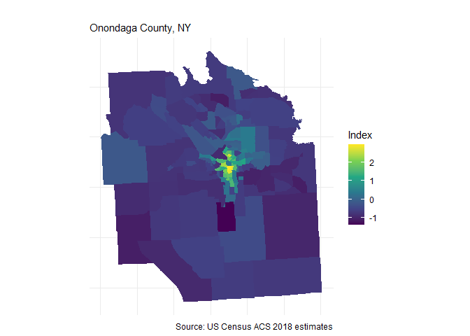
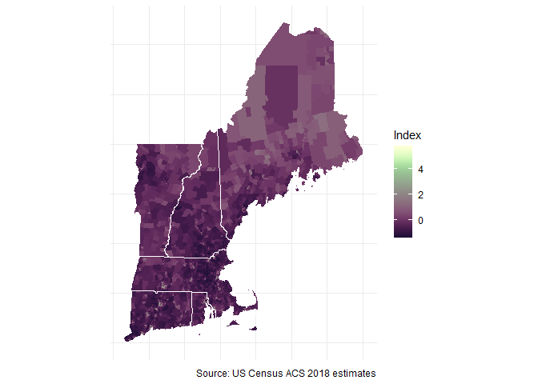

# Creating a Deprivation Index in R using Census estimates

This is an R function to extract census variables and calculate a
deprivation index. Census data fetched are American Community Survey
(ACS) 5-year estimates. Manually extracting all these estimates from
<https://factfinder.census.gov> is a time consuming process.

The index is based on methodology by [Messer and
colleagues](https://www.ncbi.nlm.nih.gov/pubmed/17031568). Messer and
colleagues identified that the principal component extracted from eight
variables (below), calculated from Census estimates, best represent
neighborhood-level deprivation.

  - % with less than HS degree (25 years and over)

  - % in below poverty level

  - % of female-headed households with children uner 18

  - % in management, science, and arts occupation

  - % in crowded households (greater than 1 occupant per room)

  - % with public assistance or food stamps

  - % unemployed (16-64 years old in labor force)

  - % with less than 30K annual household income

## Usage

`ndi` will extract Census estimates at the tract level, transform the
variables, and then perform a Principal Component Analysis by using the
arguments *State* and *County*. Since this index has been previously
validated, the function only extracts one component.

#### Housekeeping

Before using the function, a Census API key is required. You can get one
for free here: <https://api.census.gov/data/key_signup.html>.

To run this function, you’ll need a few of the core
[tidyverse](https://tidyverse.tidyverse.org/articles/paper.html)
packages, as well as
[tidycensus](https://walkerke.github.io/tidycensus/) by Kyle Walker and
[psych](https://personality-project.org/r/psych/) by William Revelle.

### Examples

``` r
library(tidycensus)
library(tidyverse)
library(psych)

#-- for plotting maps 
library(tigris)
options(tigris_class = "sf", 
        tigris_use_cache = TRUE)

#-- source script
source("R/ndi.R")

#-- index function 
ndi("NY","Onondaga")
```

    ## # A tibble: 140 x 13
    ##    Tract County State GEOID    NDI pct_poverty pct_noHS pct_FHH pct_mgmt
    ##    <chr> <chr>  <chr> <chr>  <dbl>       <dbl>    <dbl>   <dbl>    <dbl>
    ##  1 Cens~ Onond~ New ~ 3606~ -0.629      0.0987   0.0236  0.149     0.498
    ##  2 Cens~ Onond~ New ~ 3606~ -0.356      0.0913   0.0453  0.192     0.385
    ##  3 Cens~ Onond~ New ~ 3606~ -0.796      0.0462   0.0616  0.0453    0.536
    ##  4 Cens~ Onond~ New ~ 3606~ -0.782      0.0847   0.0212  0.0901    0.532
    ##  5 Cens~ Onond~ New ~ 3606~  0.404      0.192    0.172   0.382     0.290
    ##  6 Cens~ Onond~ New ~ 3606~  0.401      0.249    0.151   0.350     0.195
    ##  7 Cens~ Onond~ New ~ 3606~  1.38       0.353    0.226   0.784     0.325
    ##  8 Cens~ Onond~ New ~ 3606~  0.985      0.513    0.192   0.507     0.454
    ##  9 Cens~ Onond~ New ~ 3606~  0.935      0.392    0.307   0.291     0.156
    ## 10 Cens~ Onond~ New ~ 3606~ -0.803      0.0870   0.0683  0.0225    0.484
    ## # ... with 130 more rows, and 4 more variables: pct_crowd <dbl>,
    ## #   pct_pubassist <dbl>, pct_unempl <dbl>, pct_under30K <dbl>

The output variable *NDI* is the deprivation index score for each
corresponding census tract (CT) in the analysis. **Higher index scores
represent higher deprivation.** These scores can be explored on their
own or exported for use in statistical models.

Here is the distribution of deprivation across tracts in Onondaga
County, NY

<!-- -->

If we categorize census-tracts by Syracuse City CT and County CT, we can
see that City tracts tend to have more deprived environments than County
tracts.

<!-- -->

## Thematic Mapping

We can further explore the deprivation index by its spatial
distribution.

By mapping deprivation scores, we can see that high levels of
deprivation concentrate within the City of Syracuse. However, if we map
deprivation for city tracts only, we can still see some variation in
scores.

<!-- -->

<!-- -->

## Deprivation Index function for an entire State

By ommiting the county argument, the function will perform the same
analysis for the entire state named. Additionally, you can find a New
York City index
[here](https://github.com/iecastro/deprivation-index/blob/master/NYC/nyc_ndi.R).

### Neighborhood deprivation across New York State

<!-- -->

<!-- -->

### The 5 Boroughs

<!-- -->

## Additional examples using `ndi`

**Broward County, FL**

<!-- -->

**Virginia Beach, VA**

<!-- -->

**New England**

<!-- -->
